<!-- predev. Solutions — software house, Cairo -->
<!-- ======================= HEADER ======================= -->

  

  

<!-- ======================= SOCIAL ======================= -->

  
  
  
  
  
  
  
  

  

<!-- ======================= ABOUT ======================= -->
## 🏢 About predev.

**predev. Solutions** is a Cairo software house. We plan, design and build **mobile apps, web platforms and the brands that sell them** — in Arabic and English, for companies in Egypt, Saudi Arabia, the Gulf and beyond. Strategy, design and engineering under one roof, so nothing gets lost between companies.

- 👥 **14 full-time specialists** — 10 engineers across mobile, backend, frontend & QA, plus a brand and marketing team
- 🚢 **8+ products live in the market** across 10 industries — healthcare, HR, education, e-commerce, legal, real estate
- 💳 We build the system **behind the pay button** — wallets, payouts, invoicing, Egyptian & Gulf gateways
- 🌍 **Arabic right-to-left from day one**, not bolted on at the end
- 🔁 **Two-week build cycles**, a live demo every week, and we stay after launch
- 📫 **contact@predevsolutions.com** · 📍 **Cairo, Egypt** 🇪🇬

 

<!-- ======================= WORK ======================= -->
## 🚀 Selected Work — all live in production

| Product | What it is |
| --- | --- |
| **[Rakeez](https://rakeezhr.com)** | Our own HR & payroll SaaS — location-verified attendance, payroll, commission, contracts, hiring & an employee app |
| **[Quick App](https://quickapp-egy.com)** | Delivery marketplace — groceries, pharmacy, real estate & services with live tracking · customer, vendor & courier apps |
| **[iSpeaker](https://ispeakerlive.com)** | Arabic-first marketplace for live rooms, courses, e-books & paid consultations with creator payouts |
| **[Arabook](https://arabook.app)** | Arabic reading & writing app where writers earn from their stories — brand, design & mobile app |
| **Sofqaat** | Arabic-first CRM for real-estate sales teams — pipeline, contacts, team inbox & performance dashboards |
| **Boutros Afandy** | Legal platform connecting people with lawyers across all 27 Egyptian governorates |
| **[NileMed](https://nilemed-egypt.com)** | Medical-equipment catalog organised by hospital department, with quote requests routed to sales |
| **[BioTechnology Egypt](https://biotechnology-eg.com)** | Brand identity from scratch and a full website for a medical-devices company |

> 📇 Live demos and client references on request — **[start a project »](https://predevsolutions.com)**

<!-- ======================= SERVICES ======================= -->
## 🧭 What We Do

| Service | What you get |
| --- | --- |
| 🎯 **Product strategy** | Discovery workshops, roadmap & scope, a budget and timeline you can trust |
| 📱 **Mobile apps** | One codebase for iPhone & Android, offline-ready, notifications, App Store & Google Play release |
| 🖥️ **Web platforms** | Customer & admin portals, internal business systems, hosting, monitoring & backups |
| 🎨 **UI/UX design** | Complete design system and a clickable prototype approved before a line of code |
| 💳 **Payments & fintech** | Wallets, payouts & invoicing on Egyptian and Gulf payment gateways |
| 📣 **Brand & marketing** | Logo & identity, Arabic/English social, campaigns measured in sales |

<!-- ======================= TECH ======================= -->
## 🛠️ Tech Stack

  
   
  

#### 💻 Languages

#### 🧩 Backend &amp; Frameworks

#### 🎨 Web Frontend

#### 📱 Mobile

#### ⚡ Realtime, Search &amp; Maps

#### 💳 Payments

#### 🗄️ Data

#### ☁️ Cloud &amp; DevOps

#### 🧰 Design &amp; Tools

<!-- ======================= PROCESS ======================= -->
## 🔁 How We Work

| 01 · Discover & plan | 02 · Design | 03 · Build & test | 04 · Launch & stay |
| --- | --- | --- | --- |
| We learn the business, then fix scope, budget and a delivery plan | Flows and a full clickable prototype in Arabic & English, approved by you | Two-week cycles with a weekly demo on a live environment | Store release, staff training, then updates, monitoring & new features monthly |

<!-- ======================= CONNECT ======================= -->
## 🤝 Let's Build Your Product

  
  
  
  

<i>⚡ Have a product in mind? A discovery call costs nothing and commits you to nothing.</i>

  <b>⭐ Follow predev. on GitHub</b> — and share this page with someone who has an app idea.

