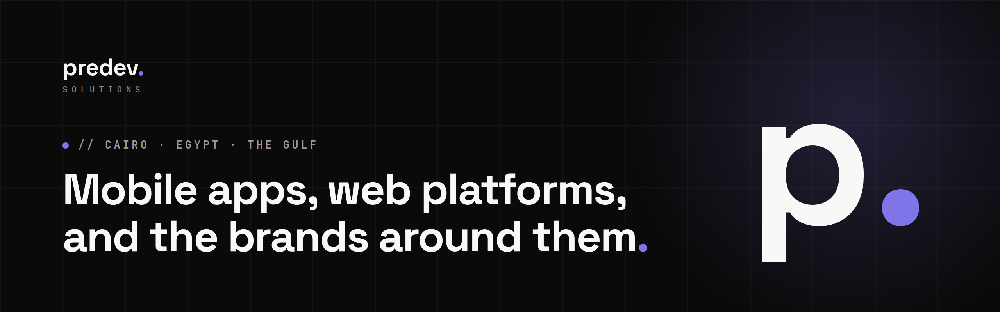

  

  
  
  
  

### Strategy, design and engineering under one roof.

**predev. Solutions** is a software house in Cairo. We plan, design and build mobile apps, web platforms and the brands that sell them, in Arabic and English, for companies in Egypt, Saudi Arabia, the Gulf and beyond.

Fourteen full-time specialists: ten engineers across mobile, backend, frontend and QA, plus a brand and marketing team. Everyone on your project has shipped real products before. No trainees, no outsourcing.

| **14** full-time specialists | **8+** products live | **10** industries | **2-week** build cycles, weekly live demo |
|:---:|:---:|:---:|:---:|

---

### What we do

| | |
|---|---|
| **Product strategy** | Discovery workshops, roadmap and scope, a budget and timeline you can trust. |
| **Mobile apps** | One codebase for iPhone and Android, offline support, notifications, App Store and Google Play release. |
| **Web platforms** | Customer and admin portals, internal business systems, hosting, monitoring and backups. |
| **UI/UX design** | Complete, consistent design, a clickable prototype before build, Arabic right-to-left from day one. |
| **Payments & fintech** | Wallets, payouts and invoicing on Egyptian and Gulf payment gateways. |
| **Brand & marketing** | Logo and identity, social media in Arabic and English, campaigns measured in sales. |

### Products we have shipped

| Product | Industry | What it is |
|---|---|---|
| [**Rakeez**](https://rakeezhr.com) | HR & payroll · *our own product* | Multi-branch HR: location-verified attendance, payroll, commission, contracts, hiring, and an employee app. |
| [**Quick App**](https://quickapp-egy.com) | Delivery & marketplace | Groceries, pharmacy, real estate and services with live tracking. Customer, vendor and courier apps. |
| [**iSpeaker**](https://ispeakerlive.com) | Education | Arabic-first marketplace for live rooms, courses, e-books and paid consultations, with creator payouts. |
| [**Arabook**](https://arabook.app) | Reading & publishing | An Arabic reading and writing app where writers earn from their stories. |
| **Sofqaat** | Real estate CRM | Arabic-first CRM for sales teams: deal pipeline, contacts, team inbox, performance dashboards. |
| **Boutros Afandy** | Legal services | Connects people with lawyers across all 27 Egyptian governorates, with a lawyer portal and admin panel. |
| [**NileMed**](https://nilemed-egypt.com) | Healthcare | Medical-equipment catalog by hospital department, with quote requests routed to sales. |
| [**BioTechnology Egypt**](https://biotechnology-eg.com) | Medical devices | Brand identity from scratch and a full website. |

Live demos and client references on request.

### Our stack

  
  
  
  
  
  
  
  
  
  
  

### How we work

1. **Discover & plan.** We learn the business, then fix scope, budget and a delivery plan.
2. **Design.** User flows and a full clickable prototype in Arabic and English, approved before build.
3. **Build & test.** Two-week cycles, a weekly demo on a live environment, testing throughout.
4. **Launch & stay.** Store release, staff training, then security updates, monitoring and new features every month.

---

  <b>Have a product in mind?</b> <a href="https://predevsolutions.com">Start a project</a> · <a href="mailto:contact@predevsolutions.com">contact@predevsolutions.com</a>

